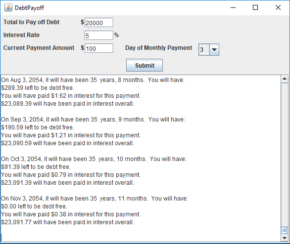

# DebtPayoff
This tool calculates compound interest and shows you when you will be out of debt at the current rate of interest and payment schedule. Play around with the numbers to see how you can get out of debt faster.

## Why I Wrote It

Years ago I needed to know how long it would take me to pay off my credit card at the suggested interest rate. Using a calculator to do compound interest made no sense, so I created this. I discovered that the rate they suggested would take me so long I would not live to see it to the end. I added a few dollars a month in the software and was shown when I could expect to be debt free. This was a real motivator to add to my payments. I used DebtPayoff for my college loans as well.

## Features

* Simple interface: Just fill out the fields in the application and click submit
* Shows payment progress with dates
* Reveals when you will have completely paid off your debt
* Tells you how much interest you have paid overall (play with monthly payment numbers to see the difference)
* All data can be copied and pasted into other applications
* Runs on any hardware (written in Java)

#### To copy and paste to another application (Windows & Linux)
* Click inside the box with the text. Use CTRL-A (simultaneously hold down the "CTRL: button and the "A" button) on your keyboard to select all text
* CTRL-C (copies the text)
* In the other application such as MS Word, Notepad, etc., click on the program, then CTRL-V (to paste text)

#### For a Mac
* Command-A (Select all)
* Command-C (Copy)
* Command-V (Paste)

My hope is that by seeing how much you save by paying an extra $10 or $20 per month, you will be greatly encouraged to pay the debt off that much faster. This application was written in 100% Java, so you will need to download Sun's [Jave Runtime Environment(JRE)](https://www.java.com/en/download/) for it to work.

If you want to work with the code, I have a tutorial on the [wiki page](https://github.com/aredshaw/DebtPayoff/wiki).

Download the program from the link below. I will redirect you to the file at Sourceforge. Double click the downloaded DebtPayoff.jar file and that's it.

Enjoy!

